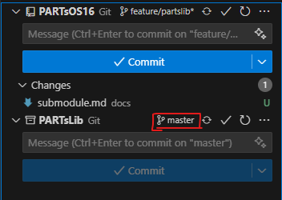

# Submodules
This is meant for our developers, but anyone can use this information.

With the 2026 year is the new PARTs Library.\
The point being generic reusable code from season to season.
That's where PARTsLib comes in.\
It's pulled down as a submodule and build with the project as a sub-project and included as a dependency.\
This means that the PARTsLib code is built along with the project anytime you build or deploy.\
The only real downside to this implementation is the added complexity.

In order to update the code in the library, you first have to make a new branch.\

When changes are made, you commit and push to your new branch.